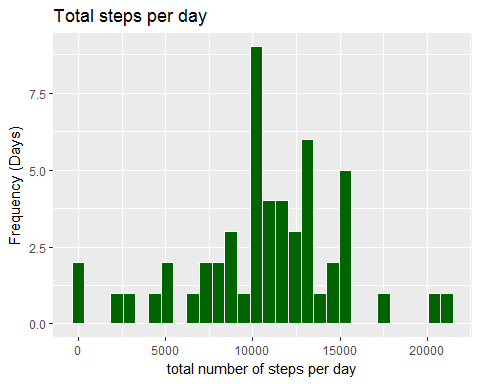
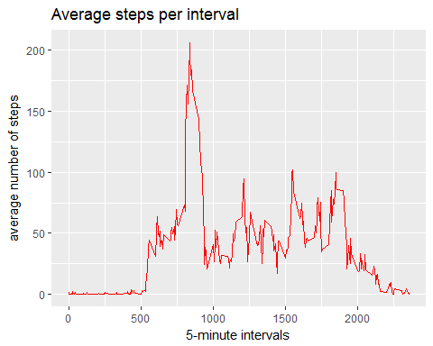
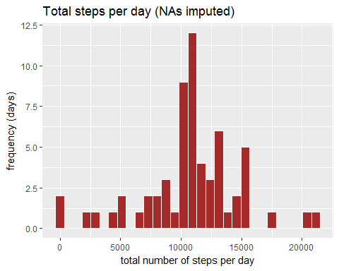
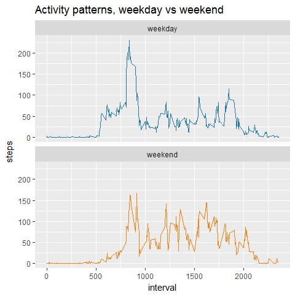

# Peer assessment 1

---

## loading and preprocessing data 


```r
#Load required packages
library(tidyverse)
library(ggthemes)
library(lubridate)
library(downloader)

# Download file +unzip it + read it into R + convert dates to date format
file  <- 
  "https://d396qusza40orc.cloudfront.net/repdata%2Fdata%2Factivity.zip"
download(file, dest = "activity.zip", mode = "wb")

unzip("activity.zip", exdir = ".")

activity  <- 
  read_csv("activity.csv") %>%
  mutate(date = ymd(date))

#Check data 
head(activity)
```

```
## # A tibble: 6 x 3
##   steps       date interval
##   <int>     <date>    <int>
## 1    NA 2012-10-01        0
## 2    NA 2012-10-01        5
## 3    NA 2012-10-01       10
## 4    NA 2012-10-01       15
## 5    NA 2012-10-01       20
## 6    NA 2012-10-01       25
```

```r
summary(activity)
```

```
##      steps             date               interval     
##  Min.   :  0.00   Min.   :2012-10-01   Min.   :   0.0  
##  1st Qu.:  0.00   1st Qu.:2012-10-16   1st Qu.: 588.8  
##  Median :  0.00   Median :2012-10-31   Median :1177.5  
##  Mean   : 37.38   Mean   :2012-10-31   Mean   :1177.5  
##  3rd Qu.: 12.00   3rd Qu.:2012-11-15   3rd Qu.:1766.2  
##  Max.   :806.00   Max.   :2012-11-30   Max.   :2355.0  
##  NA's   :2304
```

The variables included in this dataset are:

* _steps_: Number of steps taking in a 5-minute interval (missing values are coded as )
* _date_: The date on which the measurement was taken in YYYY-MM-DD format
* _interval_: Identifier for the 5-minute interval in which measurement was taken

---

>what is mean total number of steps taken per day?

1. Make a histogram of the total number of steps taken each day

2. Calculate and report the mean and median total number of steps taken per day

First, I need a new variable, the total number of steps per day, and then I plot a histogram of this variable, the total number of steps taken each day.


```r
# plot
activity  %>%
  group_by(date)  %>%
  summarize(total.steps = sum(steps))  %>%
  select(total.steps) %>%
  ggplot(aes(total.steps)) +
  geom_histogram(fill = "darkgreen", 
                 colour = "white") +
  labs(title = "Total steps per day",
       x = "total number of steps per day",
       y = "Frequency (Days)")
```




```r
# compute mean and median
activity  %>%
    group_by(date)  %>%
    summarize(tot_stps = sum(steps)) %>%
    summarise(mean_steps = mean(tot_stps, na.rm = TRUE),
              median_steps = median(tot_stps, na.rm = TRUE)) 
```

```
## # A tibble: 1 x 2
##   mean_steps median_steps
##        <dbl>        <int>
## 1   10766.19        10765
```

* _mean_:10766.19 

* _median_:10765

---

>what is the average daily activity pattern?

1. Make a time series plot  of the 5-minute interval (x-axis) and the average number of steps taken, averaged across all days (y-axis)

2. Which 5-minute interval, on average across all the days in the dataset, contains the maximum number of steps?

answer:


```r
# plot
activity %>%  
  group_by(interval) %>%
  summarise(avg.steps = mean(steps, na.rm = TRUE)) %>%
  ggplot(aes(x = interval, y = avg.steps)) +
  geom_line(colour = "red") +
  labs(title = "Average steps per interval",
       x = "5-minute intervals",
       y = "average number of steps")
```



answer:


```r
activity  %>%
    group_by(interval) %>%
    summarise(avg_steps = mean(steps, na.rm = TRUE)) %>%
    filter(avg_steps == max(avg_steps))
```

```
## # A tibble: 1 x 2
##   interval avg_steps
##      <int>     <dbl>
## 1      835  206.1698
```

Interval _835_, which contains  _206.1698_ average steps.

---

## imputing missing values

1. Calculate and report the total number of missing values in the dataset (i.e. the total number of rows with NAs)

2. Devise a strategy for filling in all of the missing values in the dataset. The strategy does not need to be sophisticated. For example, you could use the mean/median for that day, or the mean for that 5-minute interval, etc.

3. Create a new dataset that is equal to the original dataset but with the missing data filled in.

4. Make a histogram of the total number of steps taken each day and calculate and report the mean and median total number of steps taken per day. Do these values differ from the estimates from the first part of the assignment? What is the impact of imputing missing data on the estimates of the total
daily number of steps?


```r
# compute total NAs
activity  %>%
  filter(is.na(steps))  %>%
  nrow()
```

```
## [1] 2304
```


**strategy**: the missing values can be filled with the mean number of steps for the given interval. 


```r
# dataframe with the average steps per interval
int.avg.activity  <- 
  activity %>%
  group_by(interval) %>%
  summarise(avg_steps = mean(steps, na.rm = TRUE))


# missing value imputation and plotting
inner_join(activity, 
           int.avg.activity, by="interval") %>%
  mutate(steps = ifelse(is.na(steps), avg_steps, steps)) %>%
  select(date,interval,steps) %>%
  group_by(date)  %>%
  summarize(tot_stps = sum(steps))  %>%
  select(tot_stps) %>%
  ggplot(aes(tot_stps)) +
  geom_histogram(fill = "brown", colour = "white") +
  labs(title = "Total steps per day (NAs imputed)",
       x = "total number of steps per day",
       y = "frequency (days)")
```



```r
# compute mean and median
inner_join(activity, int.avg.activity,
           by="interval") %>%
  mutate(steps=ifelse(is.na(steps), avg_steps,steps)) %>%
  select(date,interval,steps) %>%
  group_by(date)  %>%
  summarize(tot_stps = sum(steps))  %>%
  summarize(mean_steps = mean(tot_stps, na.rm = TRUE), 
            median_steps = median(tot_stps, na.rm = TRUE))
```

```
## # A tibble: 1 x 2
##   mean_steps median_steps
##        <dbl>        <dbl>
## 1   10766.19     10766.19
```

* _mean_: 10766.19 
* _median_: 10766.19

As we can see the strategy devised to impute missing data did not affect the average  which is still 10766.19. Mean and Median are now the same. Overall the impact of the imputation strategy is minimal(slightly increased median) as we can see comparing these post-imputation values with the values we computed previously.


>are there differences in activity patterns between weekdays and weekends?


```r
# create new dataframe
wkday_activity <-
  inner_join(activity, int.avg.activity, 
           by="interval") %>%
  mutate(steps = ifelse(is.na(steps), avg_steps, steps)) %>%
  select(date,interval, steps) %>%
  group_by(interval) %>%
  mutate(Day = weekdays(date)) %>%
  mutate(day_indicator = factor(ifelse(Day %in% c("Saturday",
                                                     "Sunday"),
                                          "weekend", "weekday"))) 

# plot
wkday_activity %>%
  group_by(interval, day_indicator) %>%
  summarise(steps = mean(steps))  %>%
  ggplot(aes(x=interval, y=steps, color = day_indicator)) +
  scale_color_tableau(palette = "tableau10") +
  geom_line(size = .7) +
  facet_wrap(~ day_indicator, ncol = 1, nrow=2) +
  labs(title = "Activity patterns, weekday vs weekend") +
  guides(colour =FALSE)
```




Yes, from the panel plot, there seem to be differences in patterns.
There seems to be more activity earlier in the day during weekdays compared to weekends. On the other hand, activity is more evenly spread during weekends.This pattern is consistent with someone who's working during the week, and enjoying his/her weekends.


