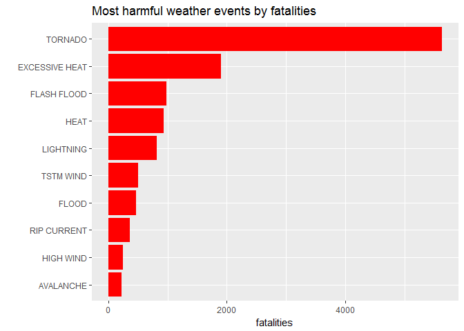
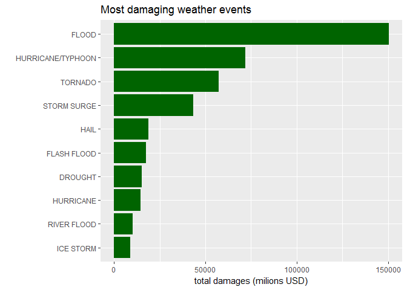

# Severe weather events impact on public health and the economy
DanielH  
August 7, 2016  

---

## Synopsis

This report is based on data from the U.S. National Oceanic and Atmospheric Administration's(NOAA) database. 
This database tracks characteristics of major storms and weather events in the United States including when 
and where they occur, as well as estimates of any fatalities, injuries, and property damage. The focus in the 
report will be on the damages caused by weather events in terms of both population health and economic impact.
More precisely the report will address the following questions:

* 1.Across the United States, which types of events (as indicated in the EVTYPE variable) are most harmful 
with respect to population health?

* 2.Across the United States, which types of events have the greatest economic consequences?


---

## Data Processing

First of all, we load the required packages, then we do the data processing. We have to:

* download,
* unzip,
* read the data 


Note: the following step can take quite long to be completed, please be patient.


```r
# load required packages
library(tidyverse)
library(forcats)

# load data
if ("storm_data.bz2" %in% dir() == FALSE) {
download.file("https://d396qusza40orc.cloudfront.net/repdata%2Fdata%2FStormData.csv.bz2",
              destfile = "storm_data.bz2")
}

storm_data2 <- 
  read_csv("storm_data.bz2",
           na = "character",
           guess_max = 180000)
```

#### Relevant variables

Given the scope of our project, we will only require the following variables to determine weather events with the greatest impact on public health and the economy. Thus, we create a subset of the original data set named _sub_data_


```r
# select relevant variables
sub_data  <- 
  storm_data2  %>%
  select(EVTYPE, FATALITIES, INJURIES, 
         dplyr::contains('DMG'))

# set vars names to lower case
colnames(sub_data) <-
  names(sub_data) %>%
  tolower()

# check
names(sub_data)
```

```
## [1] "evtype"     "fatalities" "injuries"   "propdmg"    "propdmgexp"
## [6] "cropdmg"    "cropdmgexp"
```

```r
# convert selected vars to factors
sub_data <- 
  sub_data %>%
  mutate_at(c(1, 5, 7), 
            funs(factor))
```


So, the required variables are:

* _evtype_, type of event. 
* _fatalities_ and _injuries_, to determine health impact
* _propdmg_, _propdmgexp_, _cropdmg_, _cropdmgexp_ to determine economic impact

---


## Results

>1. _Across the United States, which types of events (as indicated in the variable) are most harmful with respect to population health?_


```r
sub_data  %>%
  group_by(evtype) %>%
  summarize(fatalities = sum(fatalities),
            injuries = sum(injuries)) %>%
  top_n(10, wt = injuries)  %>%
  arrange(desc(injuries)) %>%
  ggplot(aes(fct_reorder(evtype, injuries), injuries)) +
   geom_bar(stat="identity", fill= "darkorange") +
   labs(title = "Most harmful weather events by Injuries",
        x = "",
        y = "injuries") +
   coord_flip()
```

<!-- -->

```r
sub_data %>%
  group_by(evtype) %>%
  summarize(fatalities = sum(fatalities), 
            injuries = sum(injuries)) %>%
  top_n(10, wt = fatalities)  %>%
  arrange(desc(fatalities)) %>%
  ggplot(aes(fct_reorder(evtype, fatalities), fatalities)) +
   geom_bar(stat="identity", fill= "red") +
   labs(title = "Most harmful weather\n  events by Fatalities",
           x = "", y = "fatalities") +
  coord_flip()
```

<!-- -->


---


>2. _Across the United States, which types of events have the greatest economic consequences?_

As we can see in the following tables, the factor variables _propdmgexp_ and _cropdmgexp_ have levels expressed in a very confusing fashion:


```r
# check levels
sub_data %>%
  count(propdmgexp)
```

```
## # A tibble: 19 x 2
##    propdmgexp      n
##        <fctr>  <int>
##  1            465934
##  2          -      1
##  3          ?      8
##  4          +      5
##  5          0    216
##  6          1     25
##  7          2     13
##  8          3      4
##  9          4      4
## 10          5     28
## 11          6      4
## 12          7      5
## 13          8      1
## 14          B     40
## 15          h      1
## 16          H      6
## 17          K 424665
## 18          m      7
## 19          M  11330
```

```r
# check levels
sub_data  %>%
  count(cropdmgexp) 
```

```
## # A tibble: 9 x 2
##   cropdmgexp      n
##       <fctr>  <int>
## 1            618413
## 2          ?      7
## 3          0     19
## 4          2      1
## 5          B      9
## 6          k     21
## 7          K 281832
## 8          m      1
## 9          M   1994
```

We need to convert those levels to numbers/multipliers in order to have damage figures expressed in a consistent unit and make our analysis possible.


```r
# transform PROPDMGEXP
sub_data_multip <- 
  mutate(sub_data, 
         propmultipl =
           ifelse(propdmgexp %in% c(0:8), 10,
            ifelse(propdmgexp == "h"| propdmgexp == "H", 100,
             ifelse(propdmgexp == "k"| propdmgexp == "K", 1000,
              ifelse(propdmgexp == "m"| propdmgexp == "M", 1000000,
                ifelse(propdmgexp == "b"| propdmgexp == "B",
                       1000000000, 0))))))

# transform CROPDMGEXP
sub_data_multip <-
  mutate(sub_data_multip, 
         cropmultipl =
           ifelse(cropdmgexp %in% c(0:8), 10,
            ifelse(cropdmgexp == "h"| cropdmgexp == "H", 100,
             ifelse(cropdmgexp == "k"| cropdmgexp == "K", 1000,
              ifelse(cropdmgexp == "m"| cropdmgexp == "M", 1000000,
               ifelse(cropdmgexp == "b"| cropdmgexp == "B",
                      1000000000, 0))))))


# plot
sub_data_multip %>%
  mutate(TotPropDmg = propdmg * propmultipl,
         TotCropDmg = cropdmg * cropmultipl)  %>%
  mutate(TotDmg = TotPropDmg + TotCropDmg)  %>%
  group_by(evtype) %>%
  summarise(TotDamages = sum(TotDmg)/10^6)  %>%
  arrange(desc(TotDamages))  %>%
  top_n(10) %>%
  ggplot(aes(fct_reorder(evtype, TotDamages),
             TotDamages)) +
  geom_bar(stat="identity", fill= "darkgreen") +
  labs(title = "Most damaging weather events",
       x = "",
       y = "total damages (milions USD)") +
             #theme(axis.text.x = element_text(angle = 45,
                                              #hjust = 1)) +
            coord_flip()
```

```
## Selecting by TotDamages
```

<!-- -->

### Conclusion
  
  Floods, Hurricanes and Tornadoes cause the most overall economic damages. Tornadoes are also the most harmful type of event in terms of population health.
  

